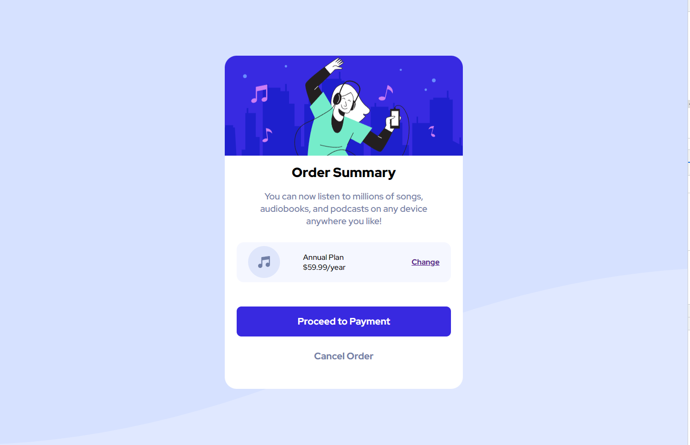
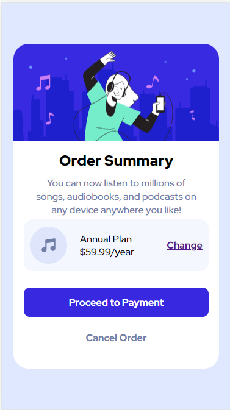

# Order-Summary-Page

challenge from front end mentor. SunnySide Agency Landing Page.

link to project: https://naser23.github.io/Order-Summary-Page/;

// SCREENSHOTS OF PROJECT //

// Desktop Version //

// Mobile Version //

;

// OVERVIEW //

I built this with html, and scss/css. this is my first sass project so its a little rough around the edges but it should pass the accessibility test. sass seems better than regular css to me off just this project.
